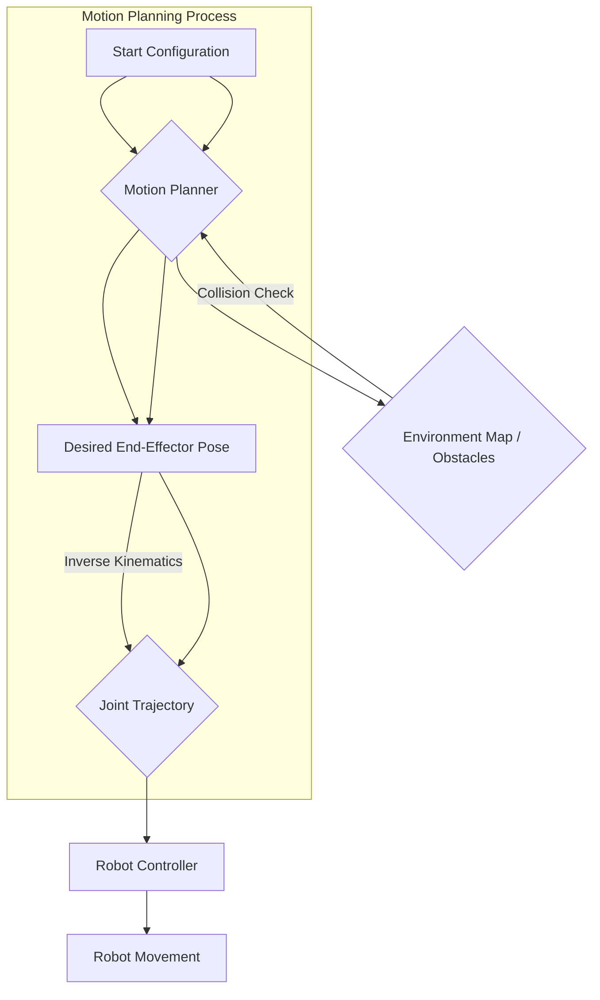

# Motion Planning Algorithms: Navigating Complex Environments

For a humanoid robot to achieve its goals in a dynamic and often cluttered world, it needs more than just the ability to perceive its surroundings; it needs a strategy to move through them safely and efficiently. This is the role of **motion planning**, a core discipline in robotics that deals with finding a sequence of valid configurations (states) that moves a robot from a starting configuration to a target configuration while avoiding obstacles and respecting robot constraints.

## Key Concepts in Motion Planning

*   **Configuration Space (C-space)**: The set of all possible positions and orientations a robot can achieve. For a humanoid robot with many degrees of freedom, the C-space is high-dimensional.
*   **Obstacle Space (C-obstacle)**: The region within the C-space that corresponds to configurations where the robot collides with obstacles. Motion planners seek to navigate the **free C-space (C-free)**.
*   **Path vs. Trajectory**:
    *   **Path**: A sequence of configurations from start to goal in C-space, without considering time.
    *   **Trajectory**: A path with a time component, specifying not only where the robot should be but also when it should be there, including velocity and acceleration profiles.

## Types of Motion Planning Algorithms

Motion planning algorithms can be broadly categorized into several approaches:

### 1. Sampling-Based Motion Planners

These algorithms explore the C-space by randomly sampling configurations and connecting them to build a roadmap or tree. They are particularly effective in high-dimensional spaces where exhaustive search is infeasible.

*   **Probabilistic Roadmaps (PRM)**:
    *   **How it works**: Constructs a graph (roadmap) in C-free by:
        1.  Randomly sampling configurations in C-free.
        2.  Connecting "visible" pairs of configurations (those that can be connected by a simple, collision-free path) with edges.
        3.  Once the roadmap is built, a query path is found by connecting the start and goal configurations to nearby nodes in the roadmap and searching the graph (e.g., using A* or Dijkstra's algorithm).
    *   **Advantages**: Computationally efficient for high-dimensional spaces, finds paths quickly.
    *   **Disadvantages**: Not guaranteed to find the optimal path, might fail to find a path in narrow passages.

*   **Rapidly-exploring Random Trees (RRT & RRT*)**:
    *   **How it works**: Builds a tree-like structure by incrementally "growing" it from the start configuration towards random samples in C-space.
        1.  Start with a tree rooted at the initial configuration.
        2.  Randomly sample a new configuration `q_rand`.
        3.  Find the nearest node `q_near` in the tree to `q_rand`.
        4.  Extend a new node `q_new` from `q_near` towards `q_rand` for a small step size, ensuring the extension is collision-free.
        5.  Add `q_new` to the tree.
    *   **RRT***: An asymptotically optimal variant of RRT that eventually converges to an optimal path if given enough time.
    *   **Advantages**: Good for quickly finding a path in complex, high-dimensional spaces; can handle non-holonomic constraints (e.g., car-like robots).
    *   **Disadvantages**: Basic RRT doesn't guarantee optimality; paths can be jerky.

### 2. Search-Based Motion Planners

These algorithms typically discretize the C-space into a grid or graph and then use graph search algorithms to find a path.

*   **A* Search Algorithm**:
    *   **How it works**: A widely used pathfinding algorithm that finds the shortest path between two points in a graph. It uses a heuristic function to estimate the cost from the current node to the goal, making it more efficient than Dijkstra's algorithm.
    *   **Advantages**: Guaranteed to find an optimal path if the heuristic is admissible (never overestimates the cost to reach the goal).
    *   **Disadvantages**: Can be computationally expensive in large, high-dimensional grids; requires a discretized C-space.

### 3. Optimization-Based Motion Planners

These approaches formulate motion planning as an optimization problem, aiming to find a path that minimizes a cost function (e.g., path length, time, energy, smoothness) while satisfying constraints (e.g., collision avoidance, joint limits).

*   **Trajectory Optimization**: Starts with an initial guess for a trajectory and iteratively refines it to minimize costs and satisfy constraints using techniques like gradient descent.

## Motion Planning for Humanoid Robots

For humanoid robots, motion planning is particularly challenging due to:

*   **High Dimensionality**: Many DOFs mean a vast C-space.
*   **Dynamic Balance**: The robot must maintain balance throughout its motion, often considering the Zero Moment Point (ZMP) or Center of Pressure (CoP).
*   **Contact Management**: Dealing with contact between feet and the ground, and hands with objects.
*   **Whole-Body Control**: Coordinating all limbs to achieve a task, like reaching while walking.

Advanced humanoid motion planners often integrate these techniques, using sampling-based methods for initial path discovery, followed by optimization-based methods to refine trajectories for smoothness and stability, all while respecting the robot's dynamic capabilities and physical constraints. This iterative process allows humanoids to navigate complex terrain and perform sophisticated tasks with human-like fluidity.

> **Citation Placeholder**: [Source: Motion Planning for Humanoids, 2024]
