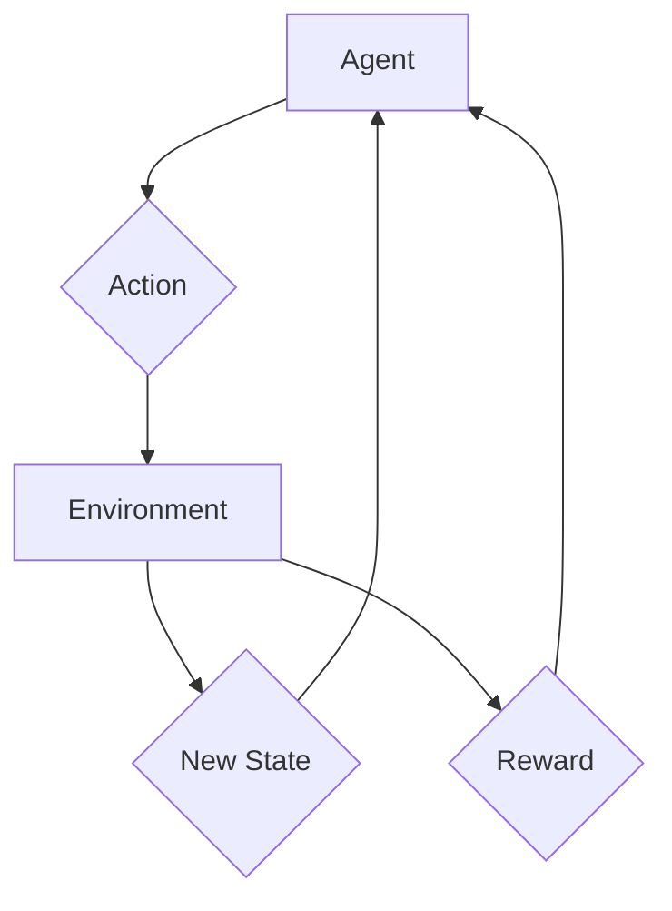

# Reinforcement Learning for Robotics: Learning by Doing

Traditional robot programming often involves meticulously defining every action and its response. However, this approach becomes intractable for complex, dynamic, and unpredictable environments. **Reinforcement Learning (RL)** offers a powerful alternative: robots learn optimal behaviors through trial and error, much like humans or animals. This chapter introduces the core concepts of RL and its transformative applications in humanoid robotics.

## Core Concepts of Reinforcement Learning

RL involves an **agent** (the robot) that interacts with an **environment** over a sequence of discrete time steps.

*   **Agent**: The learning entity (e.g., a humanoid robot) that makes decisions.
*   **Environment**: Everything outside the agent with which it interacts (e.g., the physical world, a simulation).
*   **State (S)**: The current situation of the agent and its environment. For a humanoid, this could include joint angles, velocities, sensor readings (camera images, force data).
*   **Action (A)**: A choice made by the agent that influences the environment. For a humanoid, this could be motor commands (e.g., apply torque to a joint).
*   **Reward (R)**: A scalar feedback signal from the environment that indicates how good or bad the agent's action was. The agent's goal is to maximize cumulative reward over time.
*   **Policy ($\pi$)**: The agent's strategy; it maps states to actions. An optimal policy maximizes expected long-term reward.
*   **Value Function (V or Q)**: A prediction of the future reward an agent can expect from a given state (V) or from taking a given action in a given state (Q).

The RL process is an iterative loop: the agent observes its state, selects an action according to its policy, receives a reward, transitions to a new state, and updates its policy based on this experience to improve future decision-making.

## Key Reinforcement Learning Algorithms

Several algorithms have been developed to enable agents to learn optimal policies:

*   **Model-Free vs. Model-Based RL**:
    *   **Model-Free**: The agent learns directly from experience without explicitly building a model of the environment's dynamics (e.g., Q-learning, Policy Gradients).
    *   **Model-Based**: The agent attempts to learn or is provided with a model of the environment, which it then uses for planning (e.g., Dyna, Monte Carlo Tree Search).

*   **Value-Based Methods (e.g., Q-learning, SARSA)**:
    *   Focus on learning the optimal value function, which then implicitly defines the optimal policy.
    *   **Q-learning**: Learns an action-value function Q(s, a), representing the expected future reward for taking action 'a' in state 's'. The agent then chooses actions that maximize Q.

*   **Policy-Based Methods (e.g., REINFORCE, Actor-Critic)**:
    *   Directly learn the policy function, mapping states to actions.
    *   **Policy Gradients**: Optimize the policy by performing gradient ascent on the expected reward.
    *   **Actor-Critic Methods**: Combine elements of both value-based and policy-based methods. An "actor" learns the policy, and a "critic" learns the value function to guide the actor's learning.

*   **Deep Reinforcement Learning (DRL)**: Combines RL algorithms with deep neural networks. Deep neural networks allow RL agents to process high-dimensional sensory inputs (like raw camera images) and learn complex policies without extensive feature engineering.
    *   **Deep Q-Networks (DQN)**: Uses a deep neural network to approximate the Q-value function.
    *   **Proximal Policy Optimization (PPO)**: A popular policy gradient method known for its stability and good performance across various tasks.

## Challenges and Applications in Humanoid Robotics

Applying RL to humanoid robots presents unique challenges:

*   **High-Dimensional State and Action Spaces**: Humanoids have many DOFs, leading to vast state-action spaces that are difficult to explore efficiently.
*   **Sample Efficiency**: Training RL agents often requires an enormous amount of data (experience), which can be costly and time-consuming in the real world.
*   **Sim-to-Real Gap**: Policies learned in simulation (which is much cheaper and faster for data generation) often struggle when transferred to physical robots due to discrepancies between the simulated and real environments.
*   **Safety**: Real-world trial and error can be dangerous and damaging to the robot.

Despite these challenges, RL has shown remarkable success in humanoid robotics:

*   **Locomotion**: Learning complex walking, running, and jumping gaits.
*   **Manipulation**: Learning dexterous manipulation of objects.
*   **Adaptation**: Enabling robots to adapt to uneven terrain, unexpected pushes, or changes in payload.
*   **Human-Robot Interaction**: Learning natural and intuitive ways to interact with humans.

RL is propelling humanoid robots towards greater autonomy and adaptability, allowing them to acquire skills in dynamic environments and perform tasks that were once considered impossible for pre-programmed machines. As research continues, RL will play an increasingly vital role in creating truly intelligent and versatile humanoids.

> **Citation Placeholder**: [Source: Reinforcement Learning for Robotics, 2023]
