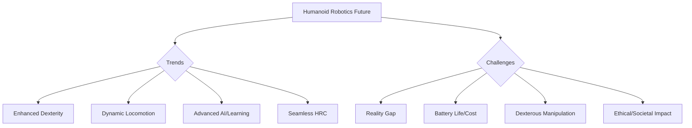

# Future Trends & Challenges in Humanoid Robotics

The field of humanoid robotics is evolving at an unprecedented pace, driven by advancements in artificial intelligence, materials science, and computational power. While the progress has been remarkable, significant challenges remain on the path to fully autonomous and ubiquitous humanoids. This chapter explores key future trends shaping the field and the major challenges that researchers and engineers are actively working to overcome.

## Future Trends

*   **Enhanced Dexterity and Manipulation**: Future humanoids will possess even finer motor control and sensory feedback, enabling them to handle delicate objects, operate complex tools, and perform intricate tasks with human-like precision. This involves advancements in multi-fingered hands, tactile sensors, and learning algorithms.
*   **More Robust and Dynamic Locomotion**: Beyond stable walking, future humanoids will master agile and adaptable locomotion, including running, jumping, climbing, and navigating highly uneven and cluttered terrains. This requires advanced whole-body control, dynamic balance algorithms, and compliant actuation.
*   **Advanced AI and Learning Capabilities**:
    *   **Lifelong Learning**: Robots will continuously learn and adapt from new experiences, rather than relying solely on pre-programmed knowledge, enabling them to acquire new skills and improve performance over time.
    *   **Common Sense Reasoning**: Integrating common sense knowledge and reasoning capabilities will allow humanoids to better understand situations, predict outcomes, and make more intelligent decisions in ambiguous contexts.
    *   **Generative AI for Robotics**: AI models could generate novel robot behaviors, designs, or even entire simulated environments, accelerating development.
*   **Seamless Human-Robot Collaboration (HRC)**: Humanoids will integrate more deeply into human workspaces and daily lives, understanding human intent, communicating naturally, and adapting their behavior for safe and efficient collaboration. This includes advancements in social intelligence and personalized interaction.
*   **Energy Efficiency and Autonomy**: Longer operational durations and reduced charging times will be achieved through more efficient actuators, optimized power management, and energy-aware motion planning.
*   **Soft Robotics and Embodied Intelligence**: Research into soft, compliant materials and structures will lead to safer, more adaptive, and physically intuitive humanoids, blurring the lines between rigid machines and biological organisms.
*   **Cloud Robotics**: Leveraging cloud computing for heavy computational tasks (e.g., large-scale mapping, complex planning, deep learning inference) allows humanoids to be lighter and more powerful.

## Major Challenges

*   **The "Reality Gap"**: Bridging the gap between policies learned in simulation and their successful transfer to real-world robots remains a significant hurdle. Even with domain randomization, achieving perfect fidelity is difficult.
*   **Battery Life and Energy Density**: The continuous demand for high power by numerous motors and sensors limits the operational duration of untethered humanoids. Improvements in battery technology and energy efficiency are crucial.
*   **Cost and Manufacturability**: Humanoid robots are currently very expensive to design, manufacture, and maintain, hindering widespread adoption. Mass production and modular designs are needed to reduce costs.
*   **Dexterous Manipulation**: Replicating the versatility and adaptability of human hands for manipulating a vast array of objects with varying properties remains incredibly difficult.
*   **Robust Perception in Unstructured Environments**: Accurately perceiving and understanding complex, dynamic, and often novel environments in real-time is challenging, especially in adverse conditions (e.g., poor lighting, occlusions).
*   **True Autonomy and Generalization**: Moving beyond performing specific tasks in controlled environments to achieving true, open-ended autonomy where robots can generalize learned skills to new, unforeseen situations.
*   **Ethical, Legal, and Societal Implications**: Addressing concerns about job displacement, privacy, accountability in case of accidents, and the broader societal impact of advanced humanoids requires ongoing dialogue and robust regulatory frameworks.
*   **Human-Robot Trust and Acceptance**: Building genuine trust and ensuring positive social acceptance of humanoids will require robots to be reliable, transparent, predictable, and culturally sensitive.

Despite these challenges, the unwavering commitment of researchers and engineers worldwide continues to push the boundaries of what humanoid robots can achieve. The future promises a world where these intelligent machines play increasingly integral roles, augmenting human capabilities and reshaping our relationship with technology.

> **Citation Placeholder**: [Source: Future of Humanoid Robotics, 2024]
