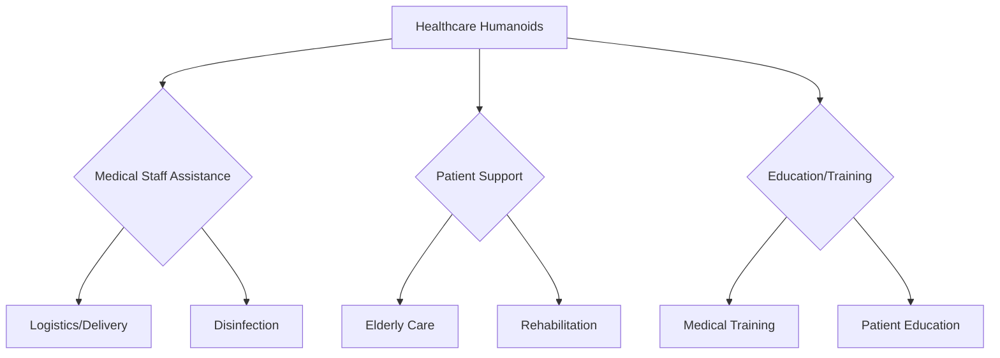

# Healthcare Humanoids: Revolutionizing Care and Assistance

The aging global population and increasing demand for healthcare services are driving a significant interest in the application of humanoid robots within the medical domain. **Healthcare humanoids** are being developed to serve a multitude of roles, from assisting medical professionals to providing companionship and support for patients. This chapter explores the burgeoning field of humanoid robotics in healthcare, highlighting their potential and current limitations.

## Roles of Humanoid Robots in Healthcare

*   **Assistance for Medical Staff**:
    *   **Logistics and Delivery**: Transporting medications, laboratory samples, and medical equipment within hospitals, freeing up human staff for more critical tasks.
    *   **Disinfection**: Autonomous disinfection robots can clean hospital rooms and operating theaters, reducing the spread of infections.
    *   **Patient Monitoring**: Equipped with sensors, humanoids can monitor vital signs, track patient movements, and alert staff to critical changes.

*   **Patient Support and Companionship**:
    *   **Elderly Care**: Providing companionship, reminding patients to take medication, assisting with mobility (e.g., walking support), and even engaging in therapeutic activities. Robots like PARO (a robotic seal) have shown positive effects on psychological well-being.
    *   **Therapy and Rehabilitation**: Guiding patients through rehabilitation exercises, providing consistent and personalized routines, and offering encouragement. Humanoids can make therapy more engaging, especially for children.
    *   **Social Interaction**: Engaging patients in conversation, playing games, and providing emotional support, particularly for those suffering from loneliness or social isolation.

*   **Surgical Assistance**:
    *   While not typically "humanoid" in form during surgery, robotic systems like the da Vinci Surgical System are advanced manipulators that assist surgeons, providing enhanced precision, dexterity, and visualization. Future humanoid designs might integrate aspects of these systems.

*   **Education and Training**:
    *   **Medical Training**: Humanoid robots can simulate patient conditions for medical students to practice diagnostic and treatment procedures in a realistic yet safe environment.
    *   **Patient Education**: Explaining complex medical conditions or treatment plans to patients in an accessible and non-threatening manner.

## Challenges and Ethical Considerations

*   **Safety and Reliability**: Humanoids operating near vulnerable patients must be impeccably safe and reliable. Malfunctions could have severe consequences.
*   **Cost**: Advanced humanoid robots are expensive to develop, purchase, and maintain, posing a barrier to widespread adoption.
*   **Social Acceptance**: While many embrace robot assistance, some patients and families may have reservations about receiving care from a machine, particularly for sensitive tasks.
*   **Privacy and Data Security**: Robots collecting patient data must adhere to strict privacy regulations (e.g., HIPAA, GDPR).
*   **Emotional Connection**: Robots can provide companionship, but they cannot replace genuine human empathy and connection.
*   **Ethical Dilemmas**: Questions arise regarding accountability in case of errors, the impact on human caregiving roles, and the definition of "care" when delivered by a machine.

## Future Outlook

Despite the challenges, the potential benefits of healthcare humanoids are immense. As robotic technology becomes more sophisticated, affordable, and socially integrated, humanoids could play an increasingly vital role in alleviating burdens on healthcare systems, improving patient outcomes, and enhancing the quality of life for many, particularly the elderly and those requiring long-term care. Research continues to focus on making these robots more intuitive, empathetic, and seamlessly integrated into the human-centric world of healthcare.

> **Citation Placeholder**: [Source: Humanoids in Healthcare, 2024]
