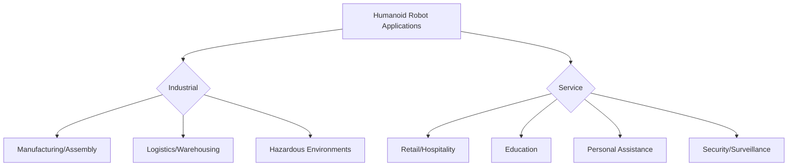

# Industrial & Service Robots: Extending Human Capabilities

Beyond specialized healthcare applications, humanoid robots are increasingly finding roles in both industrial and service sectors. While traditional industrial robots are typically fixed, caged manipulators, the advent of human-centric design and advanced AI is pushing humanoids towards more flexible, adaptable, and collaborative tasks. This chapter explores the current and future applications of humanoid robots in manufacturing, logistics, and various service industries.

## Industrial Applications: Redefining the Factory Floor

Traditional industrial robots excel at repetitive, high-precision tasks in structured environments. Humanoids, with their human-like form and dexterity, offer the potential to perform tasks designed for humans, particularly in environments not easily reconfigured for traditional automation.

*   **Assembly and Manufacturing**:
    *   **Flexible Assembly**: Humanoids can potentially operate on assembly lines designed for human workers, handling diverse parts and adapting to variations in production. Their dexterity allows for complex manipulation tasks that are difficult for simpler robotic arms.
    *   **Tool Handling**: Using human tools directly, reducing the need for specialized robotic end-effectors and jigging.
    *   **Quality Inspection**: Visual inspection tasks requiring human-like perspective and movement.

*   **Logistics and Warehousing**:
    *   **Picking and Packing**: Humanoids can navigate complex warehouse layouts, retrieve items from shelves, and pack them, especially for irregular or delicate items that challenge traditional automation.
    *   **Loading and Unloading**: Assisting in the loading and unloading of goods from trucks or containers in environments designed for human access.

*   **Hazardous Environments**:
    *   **Inspection and Maintenance**: Operating in dangerous or inaccessible areas (e.g., nuclear power plants, chemical facilities, disaster zones) to perform inspections, repairs, or data collection, protecting human workers from harm.
    *   **Construction**: Assisting with tasks in construction sites that are unsafe or physically demanding for humans.

## Service Applications: Enhancing Daily Life

Service robots operate in dynamic, often public, environments and interact directly with humans. While many service robots are not humanoid (e.g., vacuum cleaners, delivery drones), the human-like form can offer advantages in acceptance, navigation, and interaction.

*   **Retail and Hospitality**:
    *   **Customer Service**: Greeting customers, answering questions, providing product information, and guiding shoppers.
    *   **Stock Management**: Shelf auditing, restocking, and organizing products.
    *   **Cleaning and Maintenance**: Performing cleaning tasks in public spaces.

*   **Education and Research**:
    *   **Teaching Assistants**: Engaging students, providing personalized instruction, and assisting with laboratory tasks.
    *   **Research Platforms**: Serving as versatile testbeds for AI and robotics research, particularly in HRI and locomotion studies.

*   **Personal Assistance and Domestic Tasks**:
    *   **Elderly and Disabled Support**: Assisting with daily living activities, fetching objects, providing mobility support (though current capabilities are limited).
    *   **Household Chores**: Performing tasks like folding laundry, washing dishes, or organizing.

*   **Security and Surveillance**:
    *   **Patrol and Monitoring**: Autonomous patrolling of facilities, monitoring for anomalies, and reporting incidents.
    *   **Concierge Services**: Providing information and guidance in large buildings or public venues.

## Challenges and Future Outlook

While the potential is vast, several challenges remain for widespread adoption of humanoids in these sectors:

*   **Cost and Robustness**: High cost and the need for extremely robust and reliable operation in real-world conditions.
*   **Dexterity and Manipulation**: Matching human dexterity and adaptability in manipulating a wide variety of objects remains a significant challenge.
*   **Navigation in Dynamic Environments**: Reliably navigating crowded and unpredictable spaces.
*   **Human-Robot Collaboration**: Developing seamless and safe collaborative behaviors with human co-workers.
*   **Social Acceptance and Ethics**: Addressing concerns about job displacement and the ethical implications of robot integration into society.

As technology progresses, particularly in AI, vision systems, and dexterous manipulation, humanoid robots are expected to become more commonplace in industries and services, transforming productivity and quality of life by augmenting human capabilities and taking on tasks that are dull, dirty, dangerous, or difficult.

> **Citation Placeholder**: [Source: Robotics in Industry and Service, 2023]
