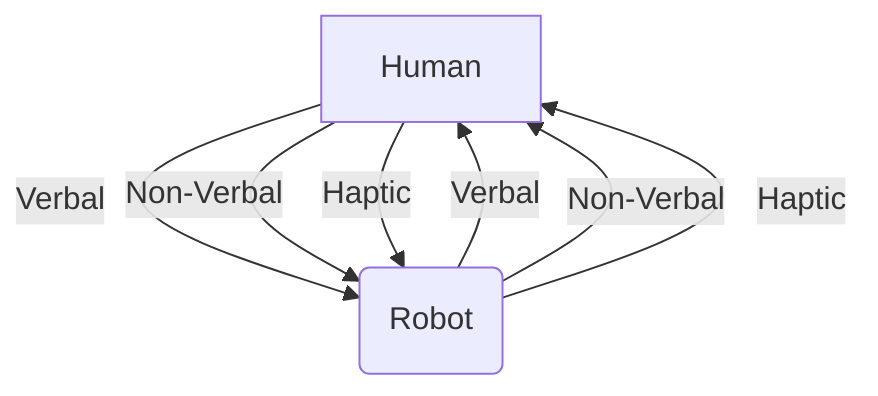

# Human-Robot Interaction (HRI): Bridging the Gap

As humanoid robots become more sophisticated and capable, their integration into human society—whether in workplaces, homes, or public spaces—hinges critically on effective **Human-Robot Interaction (HRI)**. HRI is the study of how humans and robots can communicate, collaborate, and co-exist safely and naturally. This chapter explores the principles, challenges, and mechanisms that facilitate intuitive and meaningful interactions between people and humanoid robots.

## Principles of Effective HRI

*   **Safety**: Paramount in any HRI scenario. Robots must be designed to avoid harming humans, incorporating features like compliant actuators, collision detection, and emergency stops.
*   **Intuitiveness**: Interactions should be natural and easy for humans to understand, minimizing cognitive load. This includes using familiar communication cues and predictable robot behaviors.
*   **Efficiency**: Robots should perform tasks effectively, complementing human abilities and reducing overall workload.
*   **Trust**: Humans need to trust that robots are reliable, safe, and will act in predictable ways. Trust is built through transparent behavior, clear communication, and consistent performance.
*   **Adaptability**: Robots should be able to adapt to human preferences, communication styles, and varying environmental conditions.
*   **Social Acceptability**: Robots should respect social norms and cultural contexts, making their presence and actions acceptable to humans.

## Communication Modalities

Effective HRI relies on multiple channels of communication, mimicking human-human interaction.

*   **Verbal Communication**:
    *   **Speech Recognition**: Robots must accurately understand human speech commands and natural language.
    *   **Speech Synthesis**: Robots can generate spoken responses, provide instructions, or express their status.
    *   **Natural Language Understanding (NLU)**: Beyond just recognizing words, robots need to interpret the meaning and intent behind human utterances.

*   **Non-Verbal Communication**:
    *   **Gaze and Facial Expressions**: Robots can use their "eyes" (cameras) to establish gaze, indicate attention, or even display basic "emotions" through screen-based faces or expressive lighting.
    *   **Gestures and Body Language**: Robots can use arm movements, body posture, and head nods to convey information, express intent, or acknowledge human input. Conversely, they can interpret human gestures.
    *   **Proximity and Proxemics**: The robot's distance and orientation relative to a human can communicate social intent or indicate task involvement.

*   **Haptic Communication**:
    *   **Touch and Force Feedback**: Robots can exert physical forces on humans (e.g., guiding a hand) or receive tactile input from humans, crucial for collaborative physical tasks or demonstrating compliance.
    *   **Vibration**: Haptic feedback can also be conveyed through vibrations, for example, on a human's handheld device or directly on a wearable.

## Challenges in HRI

*   **Context Understanding**: Humans rely heavily on context (social, environmental, emotional) that is difficult for robots to interpret.
*   **Unpredictability of Humans**: Human behavior is often variable and less predictable than robot behavior.
*   **Empathy and Emotion**: While robots can simulate empathy, genuine emotional understanding and response remain a significant challenge.
*   **Ethical Considerations**: Issues like privacy, accountability, and the potential impact of robots on human jobs and social structures are critical considerations in HRI.
*   **Legibility and Predictability**: Robot actions should be clear and predictable to humans, especially when operating in shared spaces.

## Future of HRI

The field of HRI is rapidly evolving, driven by advancements in AI, sensor technology, and cognitive science. Future humanoid robots will likely feature:

*   **More natural and seamless communication**: Improved NLU, sophisticated non-verbal cues.
*   **Personalization**: Robots that adapt their interaction style to individual human preferences.
*   **Long-term relationships**: Robots capable of building rapport and maintaining consistent interaction patterns over extended periods.
*   **Enhanced collaboration**: Robots that can anticipate human needs and proactively offer assistance in complex tasks.

As humanoid robots move from fiction to reality, HRI research will be vital in ensuring that these machines become not just tools, but trusted and integrated partners in our daily lives.

> **Citation Placeholder**: [Source: Human-Robot Interaction Principles, 2024]
