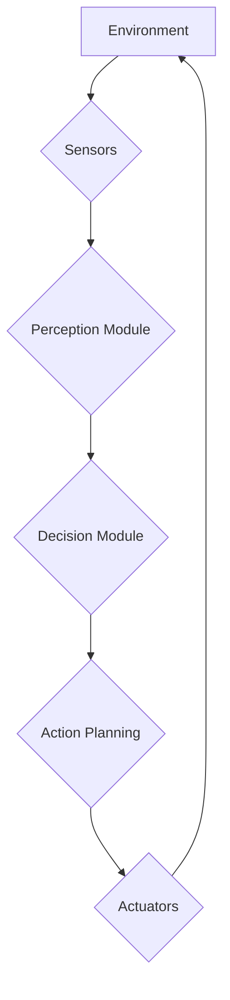

# Real-time Decision Systems: Reacting to the Dynamic World

Humanoid robots often operate in complex, unstructured, and dynamic environments where conditions can change rapidly and unpredictably. This necessitates the ability to make **real-time decisions**—choices and actions that are executed within strict time constraints to maintain stability, achieve goals, and ensure safety. This chapter explores the architecture and principles behind real-time decision systems in humanoid robotics.

## The Need for Real-time Performance

"Real-time" in robotics doesn't necessarily mean "fast"; it means "predictable." A real-time system is one that guarantees a response within a specified deadline, regardless of external factors. For humanoids, this is critical because:

*   **Stability and Balance**: Walking and balancing are inherently dynamic processes. Delays in sensor processing or actuator commands can lead to falls.
*   **Safety**: Timely detection and reaction to obstacles, unexpected events, or human presence are essential to prevent damage or injury.
*   **Interaction**: Natural human-robot interaction requires rapid responses to human gestures, speech, and movements.
*   **Dynamic Environments**: Adapting to moving objects or changing terrain requires continuous perception-action loops.

## Architectures for Real-time Decision Making

Various architectural approaches are employed to handle the computational demands of real-time decision-making.

### 1. Hierarchical Architectures

These systems typically divide control into layers, with higher layers making slower, more abstract decisions (e.g., mission planning) and lower layers making faster, more concrete decisions (e.g., joint control).

*   **Sense-Plan-Act (SPA)**: The classic robotics paradigm. The robot senses the environment, builds a complete model, plans a sequence of actions, and then executes them.
    *   **Advantages**: Highly deliberative, can make optimal long-term plans.
    *   **Disadvantages**: Often too slow for dynamic environments, susceptible to errors if the environmental model is imperfect. Not truly real-time for rapid reactions.

### 2. Reactive Architectures

These systems prioritize rapid response to sensory input over complex planning. They directly map sensory inputs to actions, often using a collection of simple, independent behaviors.

*   **Subsumption Architecture (Brooks)**: Behaviors are organized in a hierarchy, where higher-level behaviors can "subsume" (override) lower-level ones. For example, an "avoid obstacle" behavior can subsume a "move forward" behavior.
    *   **Advantages**: Fast, robust to uncertainty, can react quickly.
    *   **Disadvantages**: Can be difficult to program complex, goal-directed behaviors; emergent behavior can be hard to predict.

### 3. Hybrid Architectures

Many modern humanoid robots use a hybrid approach, combining the deliberative planning capabilities of hierarchical systems with the rapid reactivity of reactive systems.

*   **Three-Layer Architectures**:
    *   **Perceptual Layer**: Fast processing of sensor data to build a local, up-to-date model of the environment.
    *   **Deliberative Layer**: Slower, knowledge-based planning to achieve long-term goals.
    *   **Reactive Layer**: Provides immediate responses to urgent situations, typically overriding deliberative commands if necessary.

## Key Technologies for Real-time Control

*   **Real-time Operating Systems (RTOS)**: Unlike general-purpose operating systems, RTOSes are designed to guarantee that tasks complete within specific deadlines. They are used for low-level control loops in microcontrollers. Examples include FreeRTOS, RT-Linux.
*   **High-Performance Computing**: Onboard CPUs and GPUs (often combined with specialized AI accelerators) provide the necessary processing power for complex perception algorithms (e.g., deep learning inference), motion planning, and dynamic control.
*   **ROS (Robotics Operating System)**: While not an RTOS itself, ROS 2 (with its DDS middleware) offers improved real-time capabilities and Quality of Service (QoS) settings to prioritize critical communication and processing.
*   **Model Predictive Control (MPC)**: An advanced control technique that uses a dynamic model of the robot and its environment to predict future states and optimize control inputs over a receding horizon, allowing for proactive and optimized real-time decision-making.

## Decision Making in Dynamic Environments

Real-time decision systems enable humanoids to:

*   **Dynamic Obstacle Avoidance**: Adjusting gait or trajectory on-the-fly to avoid moving obstacles.
*   **Human Interaction**: Responding to human commands or physical interactions within milliseconds.
*   **Compliant Control**: Adapting to unexpected forces during manipulation or locomotion.
*   **Fault Detection and Recovery**: Rapidly identifying and reacting to system malfunctions to prevent further damage or maintain a safe state.

The continuous challenge in real-time decision systems for humanoids is balancing computational complexity with the need for speed and predictability. Advanced algorithms and specialized hardware are constantly evolving to empower robots to make sophisticated choices in the blink of an eye, allowing them to navigate and interact safely and intelligently in our shared world.

> **Citation Placeholder**: [Source: Real-time Robotics Control, 2023]
