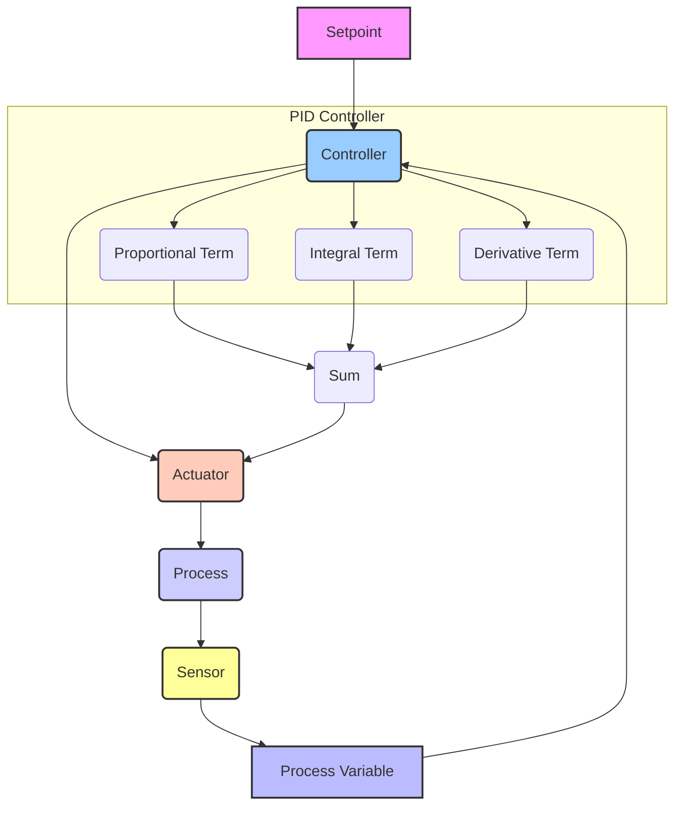

# Control Loops: The Foundation of Robot Stability and Precision

Control is the essence of robotics. For a humanoid robot to perform any task—whether it's walking, grasping an object, or simply standing still—its movements must be precisely orchestrated and continuously adjusted. This orchestration is achieved through **control loops**, which are fundamental mechanisms that enable robots to execute desired behaviors by continuously monitoring their state and making corrective actions. This chapter delves into the concept of control loops, focusing on their basic principles and a widely used example: the PID controller.

## Open-Loop vs. Closed-Loop Control

Before diving into specific control strategies, it's essential to understand the distinction between open-loop and closed-loop control:

*   **Open-Loop Control**: In an open-loop system, the control action is independent of the system's output. The controller sends a command, but there's no feedback mechanism to check if the command was successfully executed or if the system reached its desired state.
    *   **Example**: A simple timer-based motor control where the motor runs for a set duration. If the motor encounters resistance, the controller doesn't know and won't adjust.
    *   **Limitations**: Prone to errors, highly sensitive to disturbances, and cannot adapt to changing conditions. Rarely used for complex robotic movements.

*   **Closed-Loop Control (Feedback Control)**: In contrast, a closed-loop system uses **feedback** to continuously compare the actual system output with the desired input (setpoint). The difference, or error, is then used to adjust the control action.
    *   **Example**: A robot joint controller that measures the actual joint angle with an encoder, compares it to the desired angle, and adjusts motor power to reduce the error.
    *   **Advantages**: More accurate, stable, and robust to disturbances and uncertainties. Essential for achieving precise and stable motion in humanoid robots.

## The PID Controller: A Ubiquitous Solution

The **Proportional-Integral-Derivative (PID) controller** is one of the most widely used and effective feedback control mechanisms in engineering, including robotics. Its popularity stems from its relative simplicity, robustness, and applicability across a vast range of systems. A PID controller continuously calculates an "error" value as the difference between a desired setpoint (SP) and a measured process variable (PV). It then applies a correction based on three terms:

*   **Proportional (P) Term**:
    *   This term is proportional to the current error. If the error is large, the proportional response will be strong.
    *   **Effect**: Helps to reduce the current error quickly. A higher proportional gain (Kp) leads to a faster response but can also cause oscillations and instability.
    *   **Limitation**: Often results in a steady-state error (offset) because it only considers the current error and stops acting when the error is small but not zero.

*   **Integral (I) Term**:
    *   This term is proportional to the accumulation (integral) of past errors over time.
    *   **Effect**: Designed to eliminate the steady-state error by considering the history of the error. If a constant small error persists, the integral term will grow over time, eventually driving the error to zero.
    *   **Limitation**: Can cause overshoot and make the system slower to respond to changes if the integral gain (Ki) is too high.

*   **Derivative (D) Term**:
    *   This term is proportional to the rate of change (derivative) of the error. It predicts future error based on current trends.
    *   **Effect**: Provides damping to the system, helping to reduce overshoot and oscillations. It essentially "looks ahead" and applies a counteracting force.
    *   **Limitation**: Can amplify noise in the system if the derivative gain (Kd) is too high, leading to jittery control.

The output of the PID controller is the sum of these three terms, which is then sent as a command to the actuator (e.g., motor current or voltage). The gains (Kp, Ki, Kd) are tuning parameters that must be carefully selected for a given system to achieve optimal performance.

## Control Strategies in Humanoid Robots

Humanoid robots employ multiple layers of control loops:

*   **Joint-Level Control**: PID controllers are often used at the lowest level to precisely control the angle, velocity, or torque of individual joints.
*   **Kinematic Control**: Higher-level controllers use inverse kinematics to translate desired end-effector positions/orientations into joint angle commands, which are then fed to the joint-level PID controllers.
*   **Dynamic Control/Balance Control**: For bipedal locomotion, complex control loops are needed to maintain the robot's balance, manage its center of mass, and generate stable walking patterns. This often involves dynamic models of the robot and sophisticated algorithms that predict and correct for instabilities.
*   **Force Control**: Especially important for human-robot interaction or delicate manipulation, force control loops use feedback from force-torque sensors to precisely regulate the interaction forces.

Effective control loops are not just about achieving a desired position; they are about achieving it smoothly, stably, safely, and efficiently. The continuous interplay of sensing, feedback, and corrective action provided by these control systems is what allows humanoid robots to exhibit complex and dynamic behaviors.

> **Citation Placeholder**: [Source: Control Systems Engineering, 2023]
