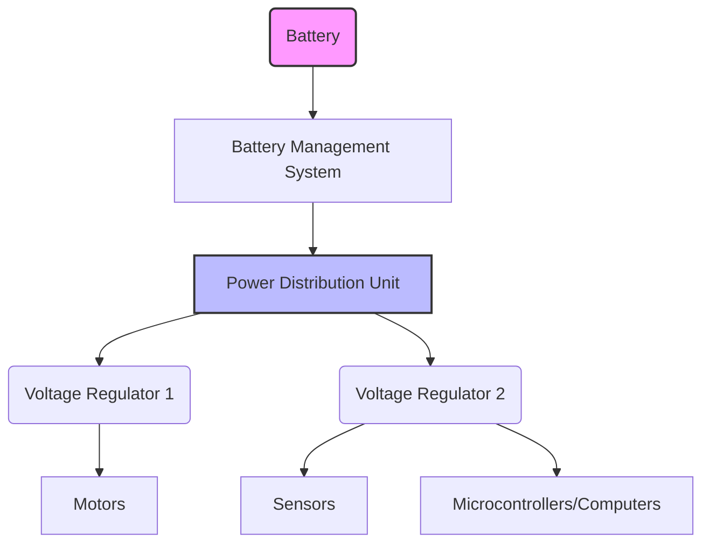

# Power Management & Electronics Basics

Power is the lifeblood of any robot, especially complex humanoid systems that demand significant energy for their numerous actuators, sensors, and onboard computing. Effective **power management** is critical not only for operational duration but also for safety, stability, and system longevity. This chapter introduces the fundamental concepts of power management in humanoid robotics and essential electronics principles.

## Batteries: The Primary Energy Source

Humanoid robots, by their nature, are often mobile and untethered, relying heavily on onboard power storage. **Batteries** are the most common solution.

*   **Lithium-ion (Li-ion) and Lithium Polymer (LiPo) Batteries**: These are the predominant choice due to their high energy density (energy per unit mass/volume), high discharge rates (ability to supply large currents quickly), and relatively long cycle life.
    *   **Voltage and Capacity**: Batteries are characterized by their nominal voltage (e.g., 3.7V per cell for Li-ion) and their capacity (measured in milliampere-hours, mAh, or ampere-hours, Ah). Robot battery packs are often composed of multiple cells in series (to increase voltage) and/or parallel (to increase capacity and discharge current).
    *   **Safety**: Li-ion and LiPo batteries are potent energy sources and require sophisticated **Battery Management Systems (BMS)** to prevent overcharging, over-discharging, over-current, and overheating, which can lead to fire or explosion.

## Power Distribution: Delivering Energy Where It's Needed

Once stored, power must be efficiently and safely distributed to all components of the robot. This involves:

*   **Voltage Regulation**: Different components (motors, sensors, microcontrollers, computers) often require different voltage levels. **Voltage regulators** (e.g., buck converters for step-down, boost converters for step-up, LDOs for low-noise regulation) ensure stable and appropriate voltage supply.
*   **Current Limiting and Fuses**: To protect sensitive electronics from damage due to excessive current draw or short circuits, current limiting circuits and fuses are strategically placed throughout the power distribution network.
*   **Power Buses**: Dedicated pathways (e.g., heavy-gauge wires, copper traces on PCBs) are designed to handle the high currents required by motors and other high-power components.
*   **Decoupling Capacitors**: Placed near integrated circuits (ICs) and other sensitive components to stabilize voltage and filter out high-frequency noise that can interfere with digital signals.

## Emergency Stop (E-Stop) Systems

Safety is paramount in humanoid robotics. An **Emergency Stop (E-Stop)** system is a critical safety feature designed to immediately cut power to actuators, bringing the robot to a safe, non-moving state. E-Stop systems must be robust, fail-safe (designed such that a failure in the system itself leads to a safe state), and easily accessible.

*   **Hardware E-Stop**: A physical button that directly breaks the power circuit, overriding all software control. This is the most reliable form of E-Stop.
*   **Software E-Stop**: A command issued through software to stop motion. While useful, it depends on the software and underlying hardware functioning correctly, making it a secondary safety measure to hardware E-stops.

## Basic Electronics Components

Understanding basic electronic components is crucial for diagnosing issues and designing robot systems.

*   **Resistors**: Limit current flow and divide voltage.
*   **Capacitors**: Store electrical energy, filter noise, and smooth voltage fluctuations.
*   **Inductors**: Store energy in a magnetic field, used in filters and power conversion.
*   **Diodes**: Allow current to flow in one direction only, used for rectification and protection.
*   **Transistors**: Act as electronic switches or amplifiers, fundamental building blocks of digital logic and motor drivers.
*   **Printed Circuit Boards (PCBs)**: Provide a structured platform for mounting and connecting electronic components, forming the intricate neural network of the robot.

## Energy Efficiency Strategies

Given the limited onboard power, maximizing energy efficiency is a key design consideration for humanoid robots:

*   **Actuator Selection**: Choosing highly efficient motors (e.g., BLDC motors) and transmissions.
*   **Regenerative Braking**: Some motor controllers can recover energy during deceleration and feed it back into the battery, similar to hybrid cars.
*   **Sleep Modes**: Powering down or reducing power to subsystems (sensors, unused actuators) when not actively in use.
*   **Mechanical Design**: Optimizing kinematics and dynamic movements to minimize energy expenditure, especially during locomotion.

Effective power management and a solid understanding of basic electronics ensure that a humanoid robot has a reliable and safe energy supply, enabling it to operate for extended periods and perform its tasks without interruption.

> **Citation Placeholder**: [Source: Robotics Power Systems, 2024]
