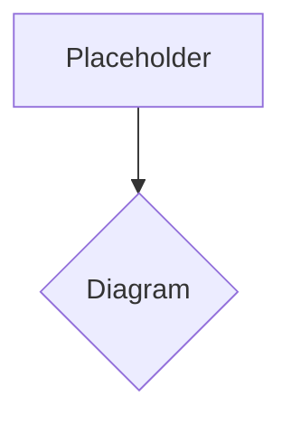

# History & Evolution of Humanoid Robots

The dream of creating intelligent, human-like machines has captivated humanity for centuries, long before the advent of modern electronics or artificial intelligence. From ancient myths to intricate automata, the desire to replicate ourselves in mechanical form has driven innovation and sparked imagination.

## Early Concepts and Automata

The earliest notions of humanoid robots can be traced back to ancient civilizations. Egyptian and Greek myths describe animated statues and mechanical servants. Heron of Alexandria, a Greek engineer in the 1st century AD, is credited with designing several automata, including mechanical birds that flapped their wings and figures that poured wine. During the Renaissance, Leonardo da Vinci sketched designs for a mechanical knight in the late 15th century, capable of sitting up, waving its arms, and moving its jaw.

The 18th century saw a flourishing of elaborate automata, particularly in Europe. Jaques de Vaucanson's "Digesting Duck" (1739) could flap its wings, quack, and even appear to eat and digest grain. Pierre Jaquet-Droz and his family created "The Writer," "The Draftsman," and "The Musician" in the 1770s, highly complex mechanical dolls that could perform sophisticated tasks, demonstrating remarkable engineering prowess for their time.

## The Industrial Age and Early Robotics

The Industrial Revolution brought about machines that automated tasks, though not human-like in form. The term "robot" itself was coined by Czech playwright Karel Čapek in his 1920 play *R.U.R. (Rossum's Universal Robots)*, derived from the Czech word "robota" meaning "drudgery" or "forced labor." Čapek's robots were artificial, biological beings rather than mechanical, but the term stuck, evoking the idea of artificial workers.

The mid-20th century saw the emergence of industrial robots, starting with George Devol's Unimate, installed at General Motors in 1961. These were programmable manipulators designed for repetitive factory tasks, marking the birth of practical robotics. While not humanoid, they laid the groundwork for control systems and automation.

## The Rise of Humanoid Research

The 1970s and 1980s saw significant research into bipedal locomotion, a critical challenge for humanoids. Early efforts faced immense difficulties in achieving stable walking. Universities and research institutions began to develop more sophisticated prototypes.

**Honda's ASIMO Project**: A pivotal moment arrived with Honda's ASIMO (Advanced Step in Innovative Mobility) program, which began in the 1980s. Early prototypes like E0 (1986) focused solely on walking. Over the decades, ASIMO evolved, first demonstrated walking stably in 2000, and later showcasing advanced capabilities like running, climbing stairs, and interacting with humans. ASIMO became an icon of humanoid robotics, inspiring many researchers and the public.

**Waseda University**: Japan has been a leader in humanoid research. Waseda University, under Professor Ichiro Kato, developed the WABOT (WAseda roBOT) series, producing some of the earliest full-scale humanoid robots, including WABOT-1 (1973), capable of walking, manipulating objects, and communicating.

## Modern Humanoid Robotics and AI Integration

The late 20th and early 21st centuries witnessed a convergence of improved mechanical design, more powerful computing, and breakthroughs in artificial intelligence. This allowed humanoids to become more dynamic, adaptable, and autonomous.

**Boston Dynamics**: Companies like Boston Dynamics have pushed the boundaries of dynamic locomotion and balance with robots like Atlas. Atlas, initially designed for disaster response, demonstrates incredible agility, balance, and complex movement patterns, showcasing how human-like form can achieve robust performance in unstructured environments.

**AI and Learning**: The integration of advanced AI techniques, such as machine learning, reinforcement learning, and computer vision, has transformed humanoids from pre-programmed automata into learning, adaptable systems. Robots can now process sensory data, make decisions in real-time, and even learn new skills through interaction and experience.

**Soft Robotics and Human-Robot Interaction**: Recent trends include research into soft robotics, which aims to create more compliant and safer robots for human interaction, and a deeper focus on natural human-robot interaction, enabling humanoids to understand and respond to human cues more effectively.

## The Future of Humanoids

The evolution of humanoid robots continues at an astonishing pace. As AI becomes more sophisticated and hardware more advanced, humanoids are poised to move from laboratories and factories into homes, hospitals, and even disaster zones, promising a future where human-like machines assist, collaborate with, and enrich human lives in unprecedented ways. The journey from ancient dreams to intelligent companions is far from over, but the progress made is a testament to human ingenuity and perseverance.

> **Citation Placeholder**: [Source: Robotics History Review, 2024]
