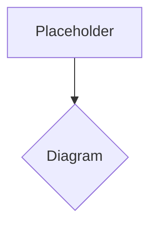

# Introduction to Humanoid Robotics

Humanoid robotics stands at the fascinating intersection of artificial intelligence, mechanical engineering, and computer science. These robots, designed to mimic the human form and often human behaviors, represent a profound ambition: to create machines that can seamlessly integrate into human environments and assist us in tasks ranging from complex manufacturing to personal care.

The concept of creating machines in our own image is not new, tracing its roots back to ancient myths and early automata. However, modern humanoid robotics, driven by rapid advancements in sensing, actuation, and artificial intelligence, has moved beyond mere mimicry. Today's humanoids are engineered to navigate challenging terrains, manipulate objects with dexterity, and even engage in forms of social interaction.

This book serves as a comprehensive guide to understanding the multifaceted world of humanoid robotics. We will explore the fundamental principles that govern their design, the cutting-edge technologies that enable their capabilities, and the sophisticated AI algorithms that power their perception, decision-making, and learning processes.

We will begin by delving into the historical context and the basic anatomical structures that define these machines. Subsequently, we will unravel the complexities of their mechanical and hardware systems, including the intricate network of sensors that allow them to perceive their surroundings and the powerful actuators that grant them movement. A significant portion of our journey will be dedicated to the embedded systems and control architectures that bring these components to life, ensuring stable and precise motion.

The heart of modern humanoid robotics, artificial intelligence, will be a central theme. We will examine how AI fuels computer vision for environmental understanding, sophisticated motion planning for navigation, and advanced reinforcement learning techniques that allow robots to adapt and learn from experience. Finally, we will explore how these diverse elements are integrated to produce coherent behaviors, discuss real-world applications, and gaze into the future trends and challenges that lie ahead in this rapidly evolving field.

Whether you are a budding engineer, an AI enthusiast, a student, or simply curious about the future of robotics, this book aims to provide a clear, structured, and technically accurate foundation to comprehend the marvels of humanoid robots and their potential to transform our world.

> **Citation Placeholder**: [Source: AI Robotics Research, 2025]