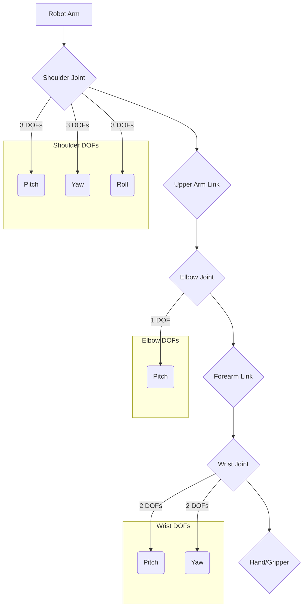

# Robot Anatomy: Structure, Joints, and Degrees of Freedom (DOF)

Humanoid robots, by their very definition, are designed to emulate the human form. This design choice is not merely aesthetic; it is driven by the desire for these robots to operate effectively within human-centric environments, interacting with tools, spaces, and objects designed for us. Understanding their anatomy—their structure, joints, and degrees of freedom—is fundamental to comprehending their capabilities and limitations.

## The Robot Skeleton: Structure and Links

At the core of any humanoid robot is its physical structure, often referred to as its "skeleton" or "frame." This structure is composed of rigid **links** connected by **joints**.

*   **Links**: These are the rigid components that make up the robot's body. In a humanoid, links correspond to body segments like the torso, upper arm, forearm, thigh, and shin. They are typically made from lightweight, high-strength materials such as aluminum alloys, carbon fiber, or specialized plastics to minimize weight while maximizing durability. The shape and length of these links are carefully designed to achieve specific reach, mobility, and stability characteristics.

*   **Structure**: The overall arrangement and composition of these links determine the robot's physical form. A typical humanoid structure includes:
    *   **Torso/Pelvis**: The central base of the robot, housing much of its core electronics, batteries, and often the main computing unit. The pelvis is crucial for bipedal balance and gait.
    *   **Head**: Contains sensors for perception (cameras, microphones) and sometimes a display for human interaction.
    *   **Arms**: Multi-jointed limbs designed for manipulation, reaching, and interaction with the environment.
    *   **Hands/End-effectors**: Specialized grippers or multi-fingered hands for grasping and manipulating objects.
    *   **Legs**: Multi-jointed limbs for locomotion, balance, and stability.
    *   **Feet**: Provide a base of support and contact with the ground, essential for stable bipedal walking and standing.

## Joints: The Articulation Points

**Joints** are the connections between links, enabling relative motion between them. They are the articulation points that give the robot its flexibility and range of motion. Robot joints are typically powered by **actuators** (e.g., motors) that enable movement and often incorporate **sensors** (e.g., encoders, potentiometers) to measure the joint's position, velocity, and force.

Common types of joints in humanoid robots include:

*   **Revolute Joint (Rotary Joint)**: This is the most common type, allowing rotational motion around a single axis. Think of an elbow, knee, or shoulder joint. Most humanoid joints are revolute.
*   **Prismatic Joint (Linear Joint)**: Allows linear motion along a single axis. While less common in the primary limbs of humanoids, they might be found in specialized end-effectors or for fine adjustments.
*   **Spherical Joint (Ball-and-Socket Joint)**: Provides rotational motion around three axes, mimicking the flexibility of a human shoulder or hip. Often, multiple revolute joints are combined to approximate a spherical joint.

The quality of a robot's joints (their precision, range of motion, speed, and force output) directly impacts its ability to perform tasks.

## Degrees of Freedom (DOF)

**Degrees of Freedom (DOF)** refer to the number of independent parameters that define the configuration of a mechanical system. In simpler terms, it's the number of distinct ways a robot's links can move. Each joint typically contributes one or more DOFs.

*   **Single DOF Joint**: A simple revolute or prismatic joint has 1 DOF.
*   **Complex Joints**: A human-like shoulder might be represented by 3 revolute joints working together to provide 3 DOFs (pitch, yaw, roll). A wrist might have 2-3 DOFs.

The total number of DOFs in a humanoid robot is a critical design parameter:

*   **Higher DOF**: Generally means greater dexterity, flexibility, and ability to navigate complex environments or perform intricate tasks. However, it also leads to increased complexity in control, more weight, higher cost, and greater power consumption.
*   **Lower DOF**: Simpler to control, lighter, and less expensive, but with limited movement capabilities.

A typical advanced humanoid robot might have 30-60 DOFs, distributed across its head, torso, arms, hands, legs, and feet. For example:
*   **Head**: 2-3 DOFs (pan, tilt)
*   **Torso/Waist**: 1-3 DOFs (yaw, pitch, roll)
*   **Arms**: 6-7 DOFs per arm (shoulder: 3, elbow: 1, wrist: 2-3)
*   **Hands**: Many DOFs depending on the complexity of the fingers (often simplified)
*   **Legs**: 5-6 DOFs per leg (hip: 3, knee: 1, ankle: 1-2)

The careful orchestration of these DOFs through sophisticated control algorithms is what allows humanoid robots to perform complex movements like walking, reaching, and object manipulation, bringing them closer to the fluidity and versatility of human motion.

> **Citation Placeholder**: [Source: Robotics Engineering Handbook, 2023]
