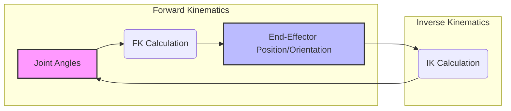

# Kinematics: Understanding Robot Motion

Kinematics is a fundamental branch of robotics that describes the motion of a robot without considering the forces or moments that cause the motion. It focuses on the geometric relationships between the robot's joints and links, particularly how the robot's end-effector (e.g., a hand or foot) moves in space relative to its base. For humanoid robots, understanding kinematics is crucial for path planning, obstacle avoidance, and precise manipulation.

## Forward Kinematics

**Forward kinematics** involves calculating the position and orientation of the robot's end-effector given the known angles or displacements of all its joints. It answers the question: "If I set the joints to these values, where will the hand be?"

Consider a simple robot arm with two revolute joints and two links, like a human elbow and wrist. If you know the angle of the shoulder joint and the angle of the elbow joint, forward kinematics would allow you to calculate the precise x, y, and z coordinates and orientation of the hand in space relative to the robot's base.

The calculation typically involves a series of transformations (rotations and translations) for each joint and link. Homogeneous transformation matrices are a common mathematical tool used to represent these transformations in a compact form, combining rotation and translation into a single matrix.

**Applications of Forward Kinematics:**
*   **Collision Detection**: Knowing the exact position of all robot parts helps prevent collisions with the environment or with itself.
*   **Visualization**: Used to render the robot's movement in simulations or graphical interfaces.
*   **Sensor Integration**: Translating sensor readings from joints into a global coordinate system.

## Inverse Kinematics

**Inverse kinematics (IK)** is generally a more complex problem than forward kinematics and involves calculating the required joint angles or displacements needed to achieve a desired position and orientation of the robot's end-effector in space. It answers the question: "If I want the hand to be at this specific position and orientation, what should the joint angles be?"

Unlike forward kinematics, which typically has a unique solution, inverse kinematics often has multiple solutions, no solutions (if the desired position is out of reach), or an infinite number of solutions (redundancy).

**Challenges in Inverse Kinematics:**
*   **Multiple Solutions**: A robot arm might be able to reach the same point in space with different elbow configurations (e.g., "elbow up" vs. "elbow down").
*   **Singularities**: Certain joint configurations can lead to a loss of one or more DOFs, making it impossible to move the end-effector in certain directions.
*   **Computational Complexity**: Solving IK for highly articulated robots (like humanoids with many DOFs) can be computationally intensive, often requiring iterative numerical methods.

**Applications of Inverse Kinematics:**
*   **Path Planning**: Essential for guiding the robot's end-effector along a desired trajectory.
*   **Grasping**: Positioning the hand precisely to pick up an object.
*   **Balance and Gait**: For humanoid robots, IK is used extensively to determine leg joint angles for stable walking and balance.

## Jacobian Matrix: Velocity and Force Relationships

The **Jacobian matrix** is a powerful tool in kinematics that relates the velocities of the robot's joints to the velocities of its end-effector. It also plays a crucial role in understanding how forces and torques are transmitted through the robot's structure.

*   **Differential Kinematics**: The Jacobian allows us to calculate how small changes in joint angles affect the end-effector's position and orientation.
*   **Singularity Analysis**: The Jacobian matrix helps identify singular configurations where the robot loses some of its maneuverability.
*   **Force Control**: It can be used to map forces applied to the end-effector to the torques required at the joints.

## Kinematics for Humanoid Locomotion

For humanoid robots, kinematics is particularly vital for achieving stable **bipedal locomotion**. The robot must constantly calculate the required joint angles for its legs and torso to maintain balance, lift its feet, and propel itself forward without falling. This involves:

*   **Center of Mass (CoM) Control**: Keeping the robot's CoM within its **support polygon** (the area defined by its feet on the ground) is paramount for stability.
*   **Footstep Planning**: Using kinematics to determine where to place the next foot to achieve desired movement and maintain balance.
*   **Whole-Body Control**: Coordinating the movements of all joints (arms, torso, head) to assist in balance and achieve complex motion patterns.

Kinematics forms the geometric backbone of robot control, enabling humanoids to translate abstract commands into precise physical movements and interactions with the environment.

> **Citation Placeholder**: [Source: Robot Kinematics Textbook, 2023]
