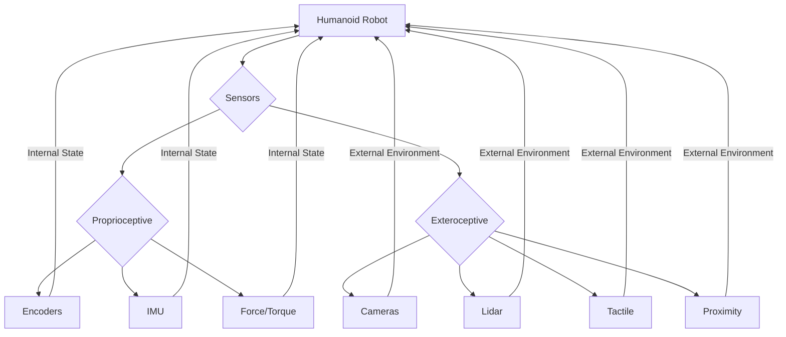

# Sensors: Perceiving the World

For a humanoid robot to interact intelligently and safely with its environment, it must first be able to perceive it. Sensors are the robot's eyes, ears, and touch, providing critical data about its own state and the surrounding world. This chapter explores the diverse array of sensors used in humanoid robotics, categorizing them by the type of information they gather.

## Proprioceptive Sensors: Knowing Oneself

Proprioceptive sensors provide feedback about the robot's internal state, such as joint angles, motor speeds, and forces exerted. This information is crucial for control, stability, and coordinated movement.

*   **Encoders**: Measure the angular position or rotation of motor shafts and joints. Optical encoders are common, providing precise digital feedback.
*   **Potentiometers**: Analog sensors that measure angular position, often used for less precise joint angle feedback.
*   **Strain Gauges/Force-Torque Sensors**: Measure the mechanical strain (deformation) in a material, which can be translated into force or torque. Essential for gripping objects without crushing them, maintaining balance, and detecting collisions. Often integrated into wrists, ankles, and fingertips.
*   **Inertial Measurement Units (IMUs)**: Combine accelerometers and gyroscopes (and sometimes magnetometers) to measure linear acceleration, angular velocity, and orientation (roll, pitch, yaw). IMUs are vital for maintaining balance, estimating body posture, and navigating.
    *   **Accelerometers**: Measure linear acceleration in three axes.
    *   **Gyroscopes**: Measure angular velocity (rate of rotation) in three axes.
    *   **Magnetometers**: Measure magnetic field strength, used for absolute orientation reference (like a compass).

## Exteroceptive Sensors: Understanding the Environment

Exteroceptive sensors gather information about the robot's external environment, enabling navigation, object detection, and interaction.

*   **Vision Systems (Cameras)**: Perhaps the most powerful exteroceptive sensors, cameras provide rich visual information.
    *   **Monocular Cameras**: Standard 2D cameras, used for object recognition, tracking, and environmental mapping (with techniques like SLAM - Simultaneous Localization and Mapping).
    *   **Stereo Cameras**: Mimic human binocular vision, using two cameras separated by a baseline to compute depth information (3D perception) through triangulation.
    *   **RGB-D Cameras**: (Red-Green-Blue-Depth) Provide both color information and per-pixel depth data, often using structured light or Time-of-Flight (ToF) principles. Examples include Intel RealSense and Microsoft Kinect. Crucial for 3D object recognition, human pose estimation, and obstacle avoidance.
*   **Lidar (Light Detection and Ranging)**: Uses pulsed laser light to measure distances to objects and create detailed 3D maps of the environment. Lidar is highly accurate and robust in varying lighting conditions.
*   **Sonar (Sound Navigation and Ranging)**: Emits ultrasonic sound waves and measures the time it takes for the echo to return to estimate distance. Simpler and cheaper than Lidar, suitable for basic obstacle detection over shorter ranges.
*   **Proximity Sensors**: Detect the presence or absence of an object without direct contact. Can be infrared (IR), capacitive, or inductive. Used for immediate obstacle avoidance and fine-tuned approach to objects.
*   **Tactile Sensors/Touch Sensors**: Provide information about physical contact, pressure, and sometimes texture. Located on fingertips, palms, or even the robot's skin, they are essential for delicate manipulation, human-robot physical interaction, and collision detection.

## Sensor Fusion: Combining Data for a Coherent World View

Rarely does a robot rely on a single sensor type. Instead, data from multiple sensors are often combined and processed through algorithms like Kalman filters or particle filters. This process, known as **sensor fusion**, creates a more robust, accurate, and complete understanding of the robot's internal state and its external environment than any single sensor could provide alone. For example, IMU data might be fused with camera data to improve localization and mapping, or force sensor data might be combined with vision to refine grasping strategies.

The effective integration and interpretation of data from this diverse sensory suite enable humanoid robots to navigate complex environments, safely interact with objects and people, and perform the intricate tasks for which they are designed.

> **Citation Placeholder**: [Source: Robotics Sensor Guide, 2023]
