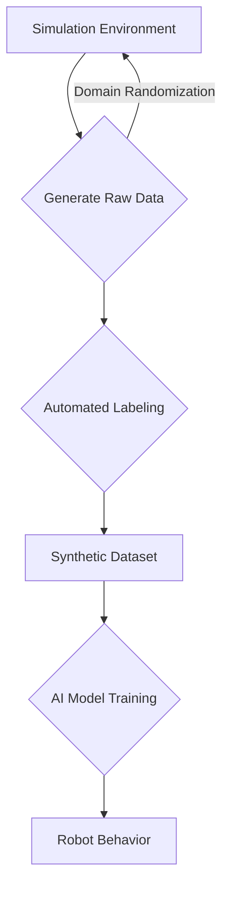

# Dataset Generation: Fueling AI with Data

Artificial Intelligence, particularly machine learning and deep learning, forms the cognitive core of modern humanoid robots. These powerful algorithms, responsible for tasks like object recognition, speech processing, motion planning, and decision-making, are only as good as the data they are trained on. **Dataset generation** is therefore a critical process, especially in robotics where real-world data collection can be challenging, expensive, and dangerous. This chapter explores various methods for generating datasets and their importance for training AI in humanoid robotics.

## The Need for Data in Robotics AI

*   **Supervised Learning**: Requires vast amounts of labeled data (e.g., images annotated with object bounding boxes, speech recordings with transcribed text) to train models for perception and classification tasks.
*   **Reinforcement Learning**: While RL agents learn through interaction, efficient exploration and learning often benefit from prior experience or a well-designed reward signal. Furthermore, learning accurate world models (model-based RL) requires data.
*   **Behavioral Cloning**: Learning complex behaviors by imitating expert demonstrations requires a dataset of state-action pairs.
*   **Sim-to-Real Transfer**: Policies or models trained in simulation need to be robust enough to transfer effectively to the real robot, which often involves careful dataset generation strategies.

## Methods of Dataset Generation

### 1. Real-World Data Collection

The most direct method is to collect data using the physical robot in the real environment.

*   **Advantages**: High fidelity, directly represents the target environment.
*   **Disadvantages**: Time-consuming, expensive, potentially dangerous (for robot and humans), difficult to reproduce specific scenarios, and can be challenging to annotate manually.

### 2. Synthetic Data Generation (Simulation)

Leveraging robotics simulators (like Gazebo, MuJoCo, Isaac Sim) to create artificial data.

*   **Advantages**:
    *   **Scalability**: Generate virtually unlimited amounts of data quickly and cheaply.
    *   **Ground Truth**: Perfect labels (e.g., object positions, depths, segmentation masks) are automatically available.
    *   **Control**: Precisely control environmental conditions, object properties, and robot states.
    *   **Safety**: No risk of damage to hardware or humans.
    *   **Diversity**: Easily introduce variations (lighting, textures, object poses) to improve model generalization.
*   **Disadvantages**:
    *   **Sim-to-Real Gap**: The biggest challenge. Data generated in simulation may not perfectly reflect the complexities of the real world, leading to trained models that perform poorly on physical robots. Techniques like domain randomization aim to bridge this gap.

### 3. Human-in-the-Loop Data Generation

Combining human intelligence with automated processes to generate or annotate data.

*   **Teleoperation**: Humans remotely control a robot (physical or simulated) to demonstrate desired behaviors, generating state-action pairs for behavioral cloning.
*   **Crowdsourcing/Active Learning**: Using human annotators to label large datasets, often guided by active learning algorithms that select the most informative samples for labeling.

## Techniques for Bridging the Sim-to-Real Gap

When using synthetic data, several strategies are employed to ensure its effectiveness for real-world robots:

*   **Domain Randomization**: Instead of trying to perfectly model the real world in simulation, this technique intentionally randomizes a wide range of simulation parameters (textures, lighting, object positions, robot parameters, sensor noise). The idea is that if the model is trained on sufficiently diverse synthetic data, it will generalize to the real world, which can be seen as just another variation within the randomized domain.
*   **Domain Adaptation**: Techniques that attempt to adapt a model trained on synthetic data to perform better on real-world data, often using unlabeled real-world data to fine-tune the model.
*   **Reality Gap Minimization**: Focus on improving the realism of the simulation itself, making the physics and rendering as accurate as possible.

Dataset generation is an increasingly vital component of the AI toolkit for humanoid robotics. As AI models grow in complexity and data demands, efficient and effective strategies for creating high-quality datasets, particularly synthetic ones, will be key to unlocking the full potential of intelligent humanoid robots.

> **Citation Placeholder**: [Source: Synthetic Data for Robotics, 2024]
