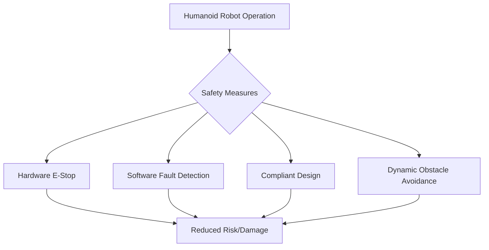

# Safety, Testing, and Debugging: Ensuring Reliable Robot Operation

The development of humanoid robots culminates in their deployment and interaction with the real world. However, this transition is fraught with challenges, primarily concerning safety, thorough testing, and efficient debugging. Ensuring that these complex machines operate reliably, predictably, and without harm is paramount. This chapter delves into the methodologies and tools used to guarantee the safe and robust operation of humanoid robots.

## Safety in Humanoid Robotics

Safety is the overriding concern in any robotic system, but especially so for humanoids designed to operate in close proximity to humans.

*   **Risk Assessment**: A systematic process to identify potential hazards associated with robot operation (e.g., collisions, unexpected movements, electrical failures), evaluate their likelihood and severity, and implement mitigation strategies.
*   **Safety Standards**: Adherence to international and national safety standards (e.g., ISO 13482 for personal care robots, ISO 10218 for industrial robots) provides guidelines for safe design and operation.
*   **Hardware Safety Mechanisms**:
    *   **Emergency Stop (E-Stop)**: Physical buttons that immediately cut power to actuators. Must be easily accessible and fail-safe.
    *   **Force/Torque Limiters**: Actuators designed to limit the force they can exert, preventing excessive impact.
    *   **Compliance/Soft Robotics**: Designing robots with inherent compliance (e.g., Series Elastic Actuators, soft materials) to absorb impacts and reduce injury risk during collisions.
    *   **Physical Barriers/Fences**: Used in industrial settings to separate robots from human workspaces.
*   **Software Safety Mechanisms**:
    *   **Safe Trajectory Planning**: Algorithms that generate paths guaranteed to avoid collisions and maintain safe distances from humans.
    *   **Dynamic Obstacle Avoidance**: Real-time replanning to react to unexpected movements of humans or objects.
    *   **Supervised Autonomy**: Human oversight or teleoperation capabilities for critical operations.
    *   **Fault Detection and Recovery**: Systems to detect malfunctions and initiate safe shutdown procedures.
*   **Human-Robot Collaboration (HRC)**: Designing robots that can share a workspace with humans, requiring advanced perception of human presence and intent, and adaptive safety behaviors.

## Testing Methodologies

Rigorous testing is essential to validate robot performance, identify bugs, and ensure safety.

*   **Unit Testing**: Verifying individual software components (e.g., a kinematic library, a sensor driver) in isolation.
*   **Integration Testing**: Checking the interactions between different software modules or hardware components.
*   **Hardware-in-the-Loop (HIL) Testing**: Simulating parts of the robot (e.g., the environment) while testing the real robot's controller and electronics, providing a realistic test bed without full physical deployment.
*   **Simulation Testing**: Using simulation platforms (Gazebo, MuJoCo) to extensively test algorithms, behaviors, and control strategies in virtual environments. This is crucial for rapid iteration and testing of dangerous scenarios.
*   **Regression Testing**: Running existing tests whenever code changes to ensure that new modifications haven't introduced old bugs.
*   **User Acceptance Testing (UAT)**: Testing by end-users or human operators to ensure the robot meets operational requirements and is user-friendly.

## Debugging Techniques and Tools

Debugging complex robotic systems, involving intertwined hardware and software, requires specialized approaches.

*   **Logging and Telemetry**: Comprehensive logging of sensor data, actuator commands, internal states, and system events. Telemetry systems allow real-time monitoring of these variables.
*   **Visualization Tools**: Software like RViz (for ROS) or custom visualization tools are indispensable for understanding the robot's perception of its environment, its planned paths, and its actual movements in 3D space.
*   **Hardware Diagnostics**: Tools for monitoring motor currents, joint temperatures, battery levels, and sensor readings to identify hardware malfunctions.
*   **Software Debuggers**: Standard software debuggers (e.g., GDB, Visual Studio Debugger) for stepping through code, inspecting variables, and identifying logical errors.
*   **Fault Injection**: Intentionally introducing errors or failures (e.g., sensor noise, actuator bias) to test the robot's robustness and fault tolerance.
*   **Post-Mortem Analysis**: Analyzing log files and recorded data after a failure event to reconstruct the sequence of events and identify the root cause.

By integrating robust safety protocols, employing systematic testing methodologies, and utilizing effective debugging tools, developers can enhance the reliability, safety, and ultimately the trustworthiness of humanoid robots, paving the way for their successful integration into human society.

> **Citation Placeholder**: [Source: Robot Safety and Testing, 2023]
