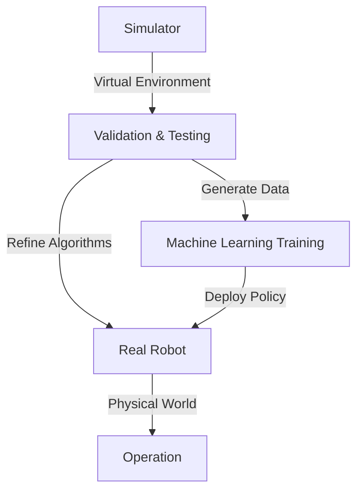

# Simulation Platforms: The Virtual Robotics Lab

Developing, testing, and refining humanoid robots in the physical world is incredibly complex, time-consuming, and often expensive or dangerous. **Simulation platforms** offer a safe, efficient, and cost-effective alternative. They provide virtual environments where robots can be designed, programmed, and tested without the risks and constraints of physical hardware. This chapter explores the importance of simulation in humanoid robotics and introduces some popular simulation platforms.

## Why Use Simulation?

*   **Safety**: Test algorithms and robot behaviors in hazardous scenarios without risking damage to expensive hardware or injury to humans.
*   **Cost-Effectiveness**: Reduce the need for physical prototypes, saving significant financial resources.
*   **Speed and Efficiency**: Run experiments much faster than in real-time, parallelize tests, and reset the environment instantly.
*   **Reproducibility**: Experiments can be precisely replicated, ensuring consistent results for debugging and algorithm comparison.
*   **Accessibility**: Researchers and developers can work on robot systems even without access to physical hardware.
*   **Data Generation**: Generate large datasets for machine learning (especially reinforcement learning) to train perception and control policies.

## Key Features of Robotics Simulators

Effective robotics simulation platforms typically offer a range of functionalities:

*   **Physics Engine**: Accurately simulates physical interactions such as gravity, friction, collisions, and joint dynamics. Examples include ODE (Open Dynamics Engine), Bullet, MuJoCo, and Gazebo's own physics engine.
*   **Realistic Rendering**: Visual representation of the robot and environment, often with textures, lighting, and camera views, aiding in visualization and perception algorithm development.
*   **Sensor Emulation**: Simulate data from various sensors (cameras, LiDAR, IMUs, force sensors) with configurable noise and imperfections, closely mimicking real-world sensor output.
*   **Robot Models**: Support for importing and defining detailed robot models (kinematics, dynamics, visuals) in standardized formats like URDF (Unified Robot Description Format) or SDF (Simulation Description Description Format).
*   **Environment Models**: Tools to create and populate virtual worlds with objects, terrains, and actors.
*   **API and Integration**: Interfaces to connect with robot control software (e.g., ROS, custom controllers) and programming languages.
*   **Distributed Simulation**: Ability to run multiple simulations in parallel across different machines.

## Popular Simulation Platforms

*   **Gazebo**:
    *   **Overview**: A widely used open-source 3D robotics simulator, particularly popular within the ROS community. It provides robust physics, high-quality rendering, and a rich set of sensor models.
    *   **Features**: Integrates with ROS, supports various physics engines, offers a comprehensive set of plugins for different sensors and actuators, and has a large community.
    *   **Use in Humanoids**: Frequently used for simulating full humanoid robots, complex environments, and testing navigation and manipulation algorithms.

*   **MuJoCo (Multi-Joint dynamics with Contact)**:
    *   **Overview**: A proprietary (now open-source through DeepMind) physics engine and simulator known for its fast and accurate contact dynamics, particularly well-suited for simulating highly articulated robots and complex manipulation tasks.
    *   **Features**: Optimized for control and state estimation, offers a powerful XML-based model format, and is often favored for reinforcement learning research involving complex movements.
    *   **Use in Humanoids**: Popular for developing and testing dynamic humanoid locomotion and dexterous manipulation policies due to its high fidelity physics.

*   **Webots**:
    *   **Overview**: An open-source robot simulator developed by Cyberbotics Ltd. It provides a complete development environment for modeling, programming, and simulating mobile robots, manipulators, and humanoids.
    *   **Features**: Includes a built-in IDE, support for various programming languages (C++, Python, Java), and can export controllers to real robots.
    *   **Use in Humanoids**: Used for education, research, and industrial prototyping, offering a user-friendly interface for building and testing humanoid models.

*   **Isaac Sim (NVIDIA)**:
    *   **Overview**: Built on NVIDIA's Omniverse platform, Isaac Sim is a scalable robotics simulation application that aims for high photorealism and physics accuracy, specifically designed for AI-based robotics research and development.
    *   **Features**: Leverages GPU acceleration, integrates with ROS and various deep learning frameworks, and allows for synthetic data generation for training AI models.
    *   **Use in Humanoids**: Increasingly used for training complex reinforcement learning policies for humanoid robots, particularly in tasks requiring realistic visual perception and dexterous manipulation.

Simulation platforms are indispensable tools in the development lifecycle of humanoid robots, accelerating research, enabling safer testing, and providing the vast amounts of data necessary to train the next generation of intelligent machines.

> **Citation Placeholder**: [Source: Robotics Simulation Best Practices, 2023]
