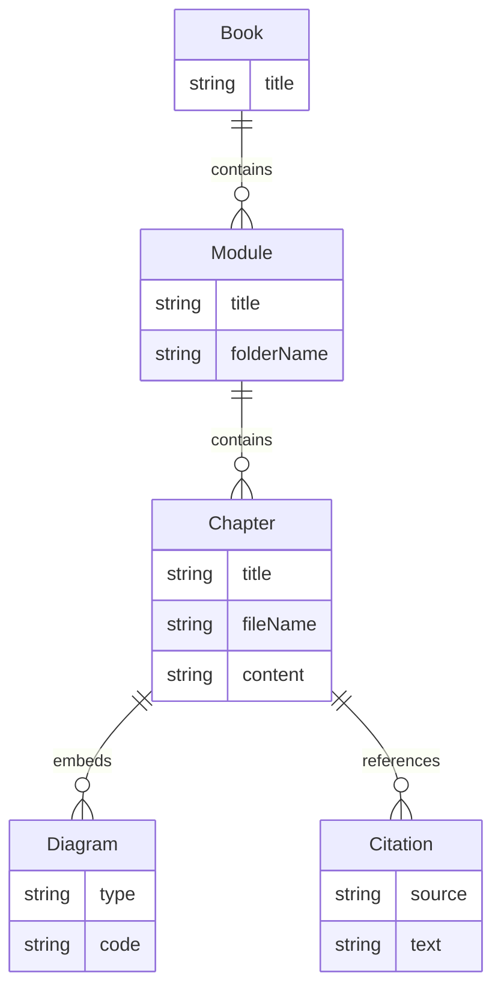

# Data Model: Humanoid Robotics AI Book

This document defines the primary data entities for the project, derived from the feature specification. As this is a documentation project, the "data model" refers to the structure of the content itself.

## Entity Relationship Diagram (ERD)

## Entity Definitions

### 1. Book

The top-level container for the entire project.

-   **Attributes**:
    -   `title` (string): The main title of the book, e.g., "Humanoid Robotics AI Book".
-   **Relationships**:
    -   Has many **Modules**.

### 2. Module

A logical grouping of chapters, corresponding to a top-level section of the book and a directory on the filesystem.

-   **Attributes**:
    -   `title` (string): The title of the module, e.g., "Foundations of Humanoid Robotics".
    -   `folderName` (string): The corresponding directory name, e.g., `foundations`.
-   **Relationships**:
    -   Belongs to one **Book**.
    -   Has many **Chapters**.

### 3. Chapter

A single Markdown file representing a specific topic.

-   **Attributes**:
    -   `title` (string): The title of the chapter, e.g., "Robot Anatomy".
    -   `fileName` (string): The Markdown filename, e.g., `robot-anatomy.md`.
    -   `content` (string): The full Markdown content of the chapter.
-   **Relationships**:
    -   Belongs to one **Module**.
    -   May have many **Diagrams**.
    -   May have many **Citations**.

### 4. Diagram

A visual aid embedded within a chapter.

-   **Attributes**:
    -   `type` (enum): The type of diagram, either `Mermaid` or `ASCII`.
    -   `code` (string): The text-based source code for the diagram.
-   **Relationships**:
    -   Belongs to one **Chapter**.

### 5. Citation

A reference to an external, reputable source to support a factual claim.

-   **Attributes**:
    -   `source` (string): The identifier for the source material (e.g., DOI, book title, URL).
    -   `text` (string): The specific text of the citation.
-   **Relationships**:
    -   Belongs to one **Chapter**.
